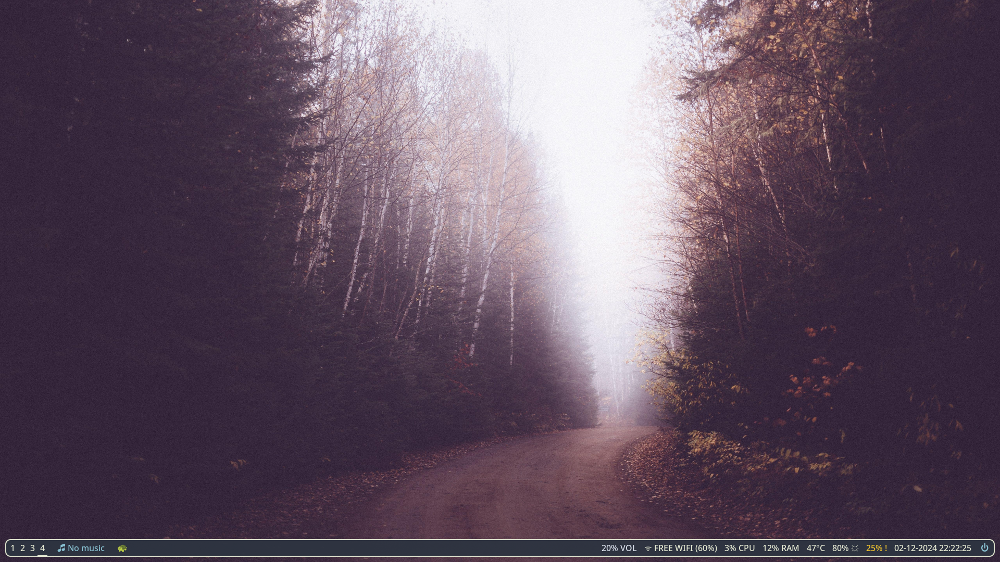
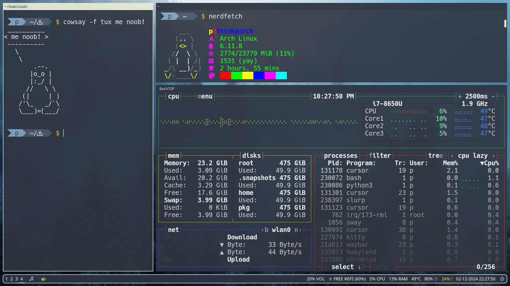
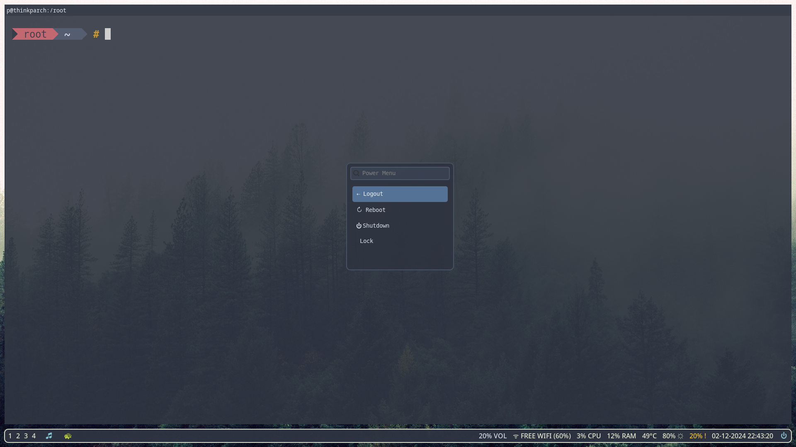

### Rice (for sway wm + kitty + waybar + starship, nordic theme)
<br>



<br>



<br>



<br>

Basically a bunch of humble dotfiles I wasted my time on and put here to use for my other machines but if you need a quick and basic headstart, here you go. I am not a professional, so please don't expect too much.

### Requirements
The install script would assume you already have the following installed:
```bash
sway
kitty
waybar
starship

#fonts:
source-code-pro
ttf-hack

#other:
wofi
swaybg
sway-screenshot
playerctl
brightnessctl
nm-applet
swaylock
pulseaudio
```


### tldr: run these. this would check necessary dependencies and overwrite **everything** with the ones in this repo:

```sh
cd /tmp/
git clone https://github.com/evgafanboi/rice.git
cd rice
chmod +x install.sh
./install.sh
```

Run the script with the components you want to install:

```sh
./install.sh sway waybar # This would install configs for sway and waybar only
./install.sh # This would install everything
./install.sh kitty sway # This would install configs for kitty and sway only
```
If you have some improvements for this and would let me know, you are a cool person.

### kitty
The font would be `hack`. It is not fat, not atrociously long or thin and it sounds cool.

### starship
**Very minimal**. Basically I removed all the flashy stuff and colors from Gruvbox Rainbow preset, replaced the some icons with their respective utf-8 code and made the colors look nordic. The `root.toml` is `starship.toml` for root, placed like this: `/root/.config/starship.toml`. You would have to do this manually as the script wont touch `/root/`.

### waybar
Nord themed waybar with functional playback module + script. Also a basic power menu using `wofi`. A lot of modules are disabled, you can enable them as you see fit.

### sway
Slightly transparent, nord theme, some gaps. Come with i3 style bindings, dmenu, `sway-screenshot` binding, reversed resize bindings. Basic wallpaper shuffles and binding to change on the fly (ctrl+shift+w).

ironically, i am vietnamese.